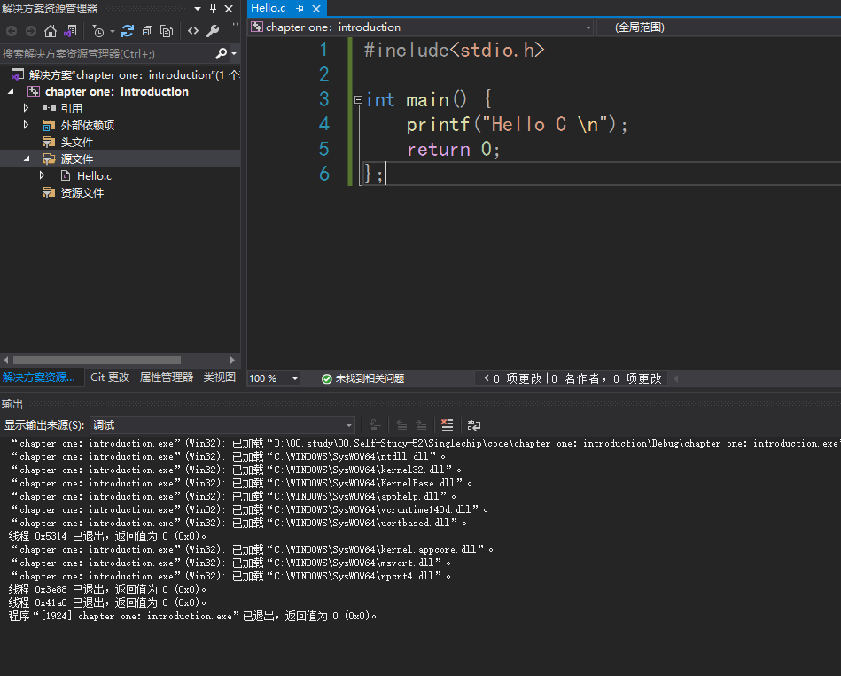
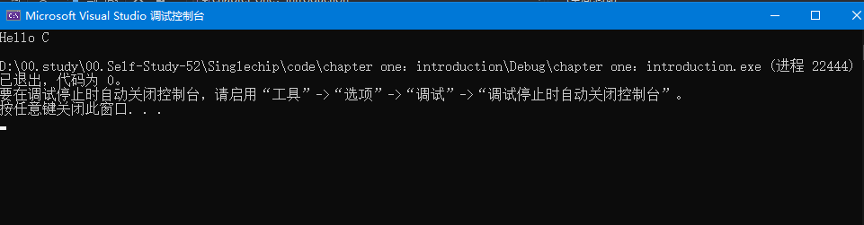
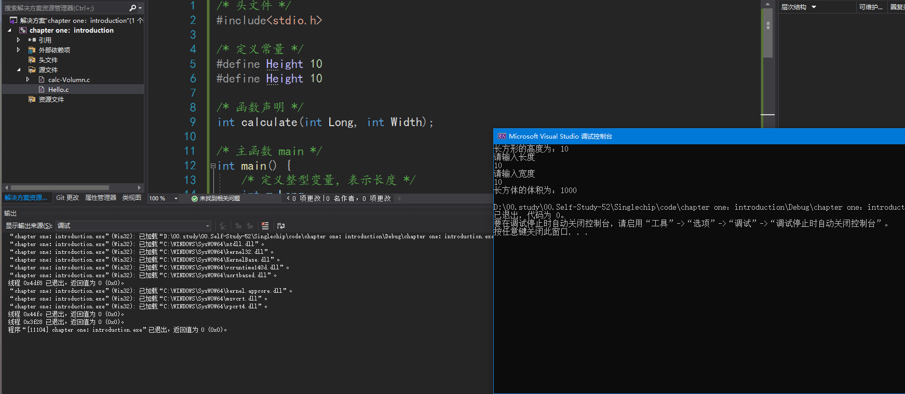
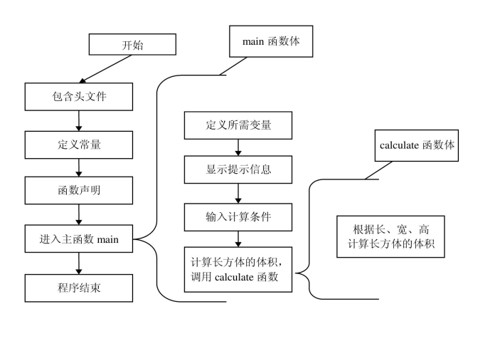

# 第一章：`C`语言简介

## 1.1 程序语言概述

在介绍C语言的发展历程之前，先对程序语言进行大概的了解。

1. **机器语言：**
   

机器语言是低级语言，也称为二进制代码语言。计算机使用的是由0和1组成的二进制数组成的一串指令来表达计算机操作的语言。机器语言的特点是，计算机可以直接识别，不需要进行任何的翻译。

2. **汇编语言：**
   

汇编语言是面向机器的程序设计语言。为了减轻使用机器语言编程的痛苦，用英文字母或符号串来替代机器语言的二进制码，这样就把不易理解和使用的机器语言变成了汇编语言。这样一来，使用汇编语言就比机器语言便于阅读和理解程序。

3. **高级语言：**

由于汇编语言依赖于硬件体系，并且该语言中的助记符号数量比较多，所以其运用起来仍然不够方便。为了使程序语言能更贴近人类的自然语言，同时又不依赖于计算机硬件，于是产生了高级语言。这种语言，其语法形式类似于英文，并且因为远离对硬件的直接操作，而易于被普通人所理解与使用。其中影响较大、使用普遍的高级语言有Fortran、ALGOL、Basic、COBOL、LISP、Pascal、PROLOG、C、C++、VC、VB、Delphi、Java等。

## 1.2 C 语言历史

语言是在由UNIX的研制者丹尼斯·里奇（Dennis Ritchie）和肯·汤普逊（Ken Thompson）于1970年研制出的BCPL语言（简称B语言）的基础上发展和完善起来的。19世纪70年代初期，AT&T Bell实验室的程序员丹尼斯·里奇第一次把B语言改为C语言。

最初，C语言运行于AT&T的多用户、多任务的UNIX操作系统上。后来，丹尼斯·里奇用C语言改写了UNIX C的编译程序，UNIX操作系统的开发者肯·汤普逊又用C语言成功地改写了UNIX，从此开创了编程史上的新篇章。UNIX成为第一个不是用汇编语言编写的主流操作系统。

尽管C语言是在大型商业机构和学术界的研究实验室研发的，但是当开发者们为第一台个人计算机提供C编译系统之后，C语言就得以广泛传播，并为大多数程序员所接受。对MS-DOS操作系统来说，系统软件和实用程序都是用C语言编写的。Windows操作系统大部分也是用C语言编写的。

C语言是一种面向过程的语言，同时具有高级语言和汇编语言的优点。C语言可以广泛应用于不同的操作系统，如UNIX、MS-DOS、Microsoft Windows及Linux等。

在C语言的基础上发展起来的有支持多种程序设计风格的C++语言、网络上广泛使用的Java、JavaScript以及微软的C#语言等。也就是说，学好C语言之后，再学习其他语言时就会比较轻松。

## 1.3 C 语言特点

1. **高效性：**

谈到高效性，不得不说C语言是“鱼与熊掌”兼得。从C语言的发展历史也可以看到，它继承了低级语言的优点，产生了高效的代码，并具有友好的可读性和编写性。一般情况下，C语言生成的目标代码的执行效率只比汇编程序低10%～20%。

2. 灵活性

C语言中的语法不拘一格，可在原有语法基础上进行创造、复合，从而给程序员更多的想象和发挥的空间。

3. 功能丰富

除了C语言中所具有的类型，还可以使用丰富的运算符和自定义的结构类型，来表达任何复杂的数据类型，完成所需要的功能。

4. 表达力强

C语言的特点体现在它的语法形式与人们所使用的语言形式相似，书写形式自由，结构规范，并且只需简单的控制语句即可轻松控制程序流程，完成繁琐的程序要求。

5. 移植性好

由于C语言具有良好的移植性，从而使得C程序在不同的操作系统下，只需要简单的修改或者不用修改即可进行跨平台的程序开发操作。

## 1.4 一个 C 语言程序

~~~c
#include<stdio.h>

int main() {
	printf("Hello C \n");
	return 0;
};
~~~

1. **#include指令**

~~~c
#include<stdio.h>
~~~

这个语句的功能是进行有关的预处理操作。`include`成为文件包含命令，后面尖括号中的内容成为头部文件或首文件。

2. **空行**

实例代码中的第二行。
C语言是一个较灵活的语言，因此格式并不是固定不变、拘于一格的。也就是说，空格、空行、跳格并不会影响程序。有的读者就会问：“为什么要有这些多余的空格和空行呢？”其实这就像生活中在纸上写字一样，虽然拿来一张白纸就可以在上面写字，但是通常还会在纸的上面印上一行一行的方格或段落，隔开每一段文字，自然就更加美观和规范。合理、恰当地使用这些空格、空行，可以使编写出来的程序更加规范，对日后的阅读和整理发挥着重要的作用。在此也提醒读者，在写程序时最好将程序书写得规范、干净。

**注意:**

> 不是所有的空格都没有用，如在两个关键字之间用空格隔开（else if），这种情况下如果将空格去掉，程序就不能通过编译。在这里先进行一下说明，在以后章节的学习中就会慢慢领悟

3. **`main`函数声明**

~~~c
int main(){...}
~~~

4. **函数体**

~~~c
{
	printf("Hello C \n");
	return 0;
};
~~~

两个大括号就构成了函数体，函数体也可以称为函数的语句块。

5. **执行语句**

~~~c
printf("Hello C \n");
~~~

执行语句就是函数体中要执行的动作内容。

6. **`return` 语句**

~~~c
return 0;
~~~

行语句使main函数终止运行，并向操作系统返回一个整型常量0。前面介绍main函数时，说过返回一个整型返回值，此时0就是要返回的整型值。

## 1.5 一个完整的 C 程序

现这样的功能：有一个长方体，它的高已经给出，然后输入这个长方体的长和宽，通过输入的长、宽以及给定的高度，计算出长方体的体积。

~~~c
/* 头文件 */
#include<stdio.h>

/* 定义常量 */
#define Height 10
#define Height 10

/* 函数声明 */
int calculate(int Long, int Width);

/* 主函数 main */
int main() {
	/* 定义整型变量，表示长度 */
	int m_Long;
	/* 定义整型变量，表示宽度 */
	int m_Width;
	/* 定义整型变量，表示长方体的体积 */
	int result;
	/* 显示提示 */
	printf("长方形的高度为：%d\n", Height);
	/* 显示提示 */
	printf("请输入长度\n");
	/* 输入 */
	scanf_s("%d", &m_Long);
	/* 显示提示 */
	printf("请输入宽度\n");
	/* 输入 */
	scanf_s("%d", &m_Width);
	/* 调用函数计算值 */
	result = calculate(m_Long, m_Width);
	printf("长方体的体积为：");
	printf("%d\n", result);
	return 0;
}

// 计算函数
int calculate(int Long, int Width) {
	int result = Long * Width * Height;
	return result;
}
~~~

::: tip 【程序流程图】

:::

## 1.6 C 语言格式

1. **主函数main**

一个C程序都是从main函数开始执行的。main函数不论放在什么位置都没有关系。

2. **C程序整体是由函数构成的**

程序中main就是其中的主函数，当然在程序中是可以定义其他函数的。在这些定义函数中进行特殊的操作，使得函数完成特定的功能。虽然将所有的执行代码全部放入main函数也是可行的，但是如果将其分成一块一块，每一块使用一个函数进行表示，那么整个程序看起来就具有结构性，并且易于观察和修改。

3. **函数体的内容在“{}”中**

每一个函数都要执行特定的功能，那么如何才能看出一个函数的具体操作的范围呢？答案就是寻找“{"和"}”这两个大括号。C语言使用一对大括号来表示程序的结构层次，需要注意的就是左右大括号要对应使用。
	技巧:在编写程序时，为了防止对应大括号的遗漏，每次都可以先将两个对应的大括号写出来，再向括号中添加代码。

4. **每一个执行语句都以“;”结尾**

如果注意观察前面的两个实例就会发现，在每一个执行语句后面都会有一个“;”（分号）作为语句结束的标志。

5. **英文字符大小通用**

在程序中，可以使用英文的大写字母，也可以使用英文的小写字母。但一般情况下使用小写字母多一些，因为小写字母易于观察。但是在定义常量时常常使用大写字母，而在定义函数时有时也会将第一个字母大写。
