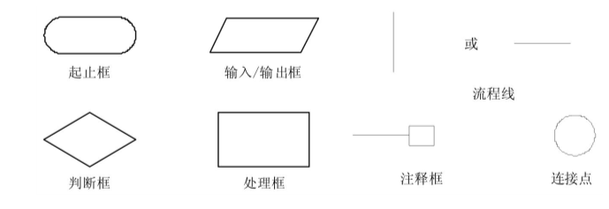

# 第二章：算法（Algorithm）

算法与程序设计以及数据结构密切相关，是解决一个问题的完整的步骤描述，是解决问题的策略、规则、方法。算法的描述形式有很多种，像传统流程图、结构化流程图及计算机程序语言等。

## 算法的特性

- 有穷性

一个算法必须在执行有穷步之后结束且每一步都可在有穷时间内完成，不能无限地执行下去。如要编写一个由小到大整数累加的程序，这时要注意一定要设一个整数的最上限，也就是加到哪个数为止。若没有这个最上限，那么程序将无终止地运行下去，也就是常说的死循环。

- 确定性

算法的每一个步骤都应当是确切定义的，对于每一个过程不能有二义性，将要执行的每个动作必须作出严格而清楚的规定。

- 可行性

算法中的每一步都应当能有效地运行，也就是说算法是可执行的，并要求最终得到正确的结果。

- 输入

一个算法应有零个或多个输入，输入是在执行算法时需要从外界取得必要的如算法所需的初始量等一些信息。

- 输出

一个算法有一个或多个输出。什么是输出？输出就是算法最终所求的结果。编写程序的目的就是要得到一个结果，如果一个程序运行下来没有任何结果，那么这个程序本身也就失去了意义。

## 算法的优劣

分析一个算法的好坏，通常以一下几点来判断。

- 确定性

也就是所写的算法能满足具体问题的要求，即对任何合法的输入算法都会得出正确的结果。

- 可读性

是指算法被写好之后，该算法被理解的难易程度。一个算法可读性的好坏十分重要，如果一个算法比较抽象，难于理解，那么这个算法就不易交流和推广使用，对于修改、扩展、维护都十分不方便。因此在写一个算法时，要尽量将该算法写得简明易懂。

- 健壮性

一个程序完成后，运行该程序的用户对程序的理解各有不同，并不能保证每一个人都能按照要求进行输入。健壮性就是指当输入的数据非法时，算法也会作出相应判断，而不会因为输入的错误造成瘫痪。

- 时间复杂度和空间复杂度

简单地说，时间复杂度就是算法运行所需要的时间。不同的算法具有不同的时间复杂度，当一个程序较小时，就感觉不到时间复杂度的重要性；当一个程序特别大时，便会察觉到时间复杂度实际上是十分重要的。因此写出更高速的算法一直是算法不断改进的目标。空间复杂度是指算法运行所需的存储空间的多少。随着计算机硬件的发展，空间复杂度已经不再显得那么重要。

## 算法的描述

**1.1 自然语言：**

自然语言就是人们日常用的语言，这种表示方式通俗易懂。

【例】　任意输入3个数，求这3个数中的最小数。
（1）定义4个变量分别为x、y、z以及min。
（2）输入大小不同的3个数分别赋给x、y、z。
（3）判断x是否小于y，如果小于，则将x的值赋给min，否则将y的值赋给min。
（4）判断min是否小于z，如果小于，则执行步骤（5），否则将z的值赋给min。
（5）将min的值输出。

### 1.2 流程图

流程图是一种传统的算法表示法，它用一些图框来代表各种不同性质的操作，用流程线来指示算法的执行方向。由于它直观形象，易于理解，所以应用广泛，特别是在语言发展的早期阶段，只有通过流程图才能简明地表述算法。

流程图符号：

**（1）顺序结构：**

顺序结构是简单的线性结构，在顺序结构的程序中，各操作是按照它们出现的先后顺序执行的。

**（2-1）选择结构：双分支：**

选择结构中必须包含一个判断框。根据给定的条件P是否成立选择执行A框或者是B框。

**（2-2）选择结构：单分支：**

据给定的条件P进行判断，如果条件成立则执行A框，否则什么也不做。

**（3-1）循环结构：**

在循环结构中，反复地执行一系列操作，直到条件不成立时才终止循环。按照判断条件出现的位置，可将循环结构分为当型循环结构和直到型循环结构。

型循环是先判断条件P是否成立，如果成立，则执行A框；执行完A框后，再判断条件P是否成立，如果成立，接着再执行A框；如此反复，直到条件P不成立为止，此时不执行A框，跳出循环。

**（3-2）当型循环：**

直到型循环是先执行A框，然后判断条件P是否成立，如果条件P成立则再执行A；然后判断条件P是否成立，如果成立，接着再执行A框；如此反复，直到条件P不成立，此时不执行A框，跳出循环。

### 1.3 N-S流程图：

N-S图是另一种算法表示法，是由美国人I.Nassi和B.Shneiderman共同提出的，其根据是：既然任何算法都是由前面介绍的3种结构组成，则各基本结构之间的流程线就是多余的，因此去掉了所有的流程线，将全部的算法写在一个矩形框内。N-S图也是算法的一种结构化描述方法，同样也有3种基本结构。

（1）顺序结构

（2）选择结构

（3-1）循环结构

（3-2）当型循环

### 例子

【案例1】从键盘中输入一个数n，求n！。

~~~c
#include<stdio.h>

int main() {
	int i;
	int n;
	double s = 1;
	/*输入n值*/
	printf("请输入要计算阶乘的数值：\n");
	scanf_s("%d", &n);
	if (n >= 0) {
		for (i = 1; i <= n; i++) {
			s = s * i;
		};
		printf("%d!=%lf \n", n, s);
	}
	else {
		printf("Error \n");
	};
	return 0;
};
~~~

::: details 流程图

- 流程图

- N-S流程图

:::

